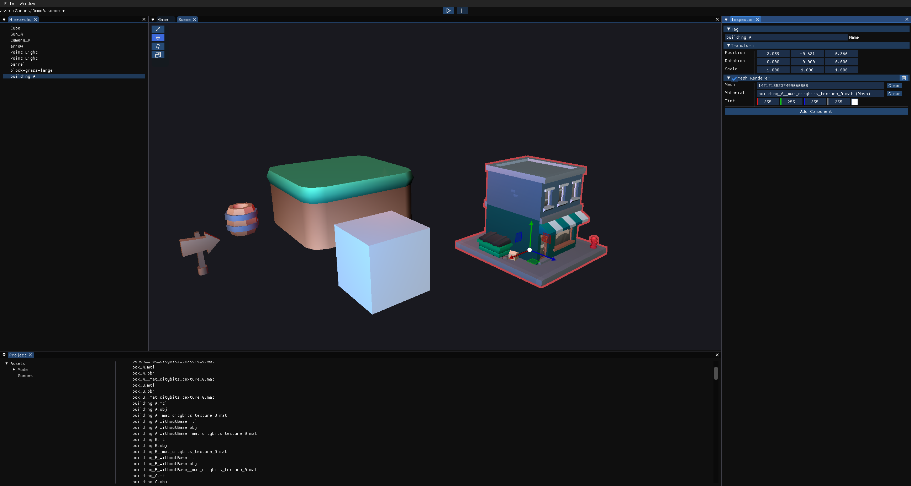

# Hybrid Engine
[](README.md)
[](README_zh-CN.md)
[](https://isocpp.org/)
[](./LICENSE)

> 一个以现代引擎架构学习、系统实现与编辑器工作流验证为目标的个人引擎项目。



## 项目概览

[](#环境要求)
[](#功能与当前状态)
[](#功能与当前状态)
[](#功能与当前状态)
[](#roadmap)

Hybrid Engine 是一个以学习、研究和实践现代引擎架构为目标的个人项目。这个项目的重点并不只是做出一个可运行的引擎原型，而是在实际实现过程中，逐步理解各个核心模块的职责划分、协作方式以及架构边界，并在此基础上持续探索值得深入打磨的技术方向。

目前项目主要处于基础框架搭建阶段，内容涵盖渲染、资源管理、场景系统、编辑器、输入、事件、物理等核心部分。在整体框架逐渐稳定之后，我们计划从中选择若干关键方向继续深入，例如渲染管线优化、复杂物理系统实现、引擎性能优化与性能分析、编辑器交互与工作流逻辑，并逐步推动项目向跨平台与多图形 API 支持演进。

这个项目既是一个长期的引擎学习过程，也是一个用于验证架构思路、积累工程经验和探索技术细节的持续性实践平台。

## 状态速览

| 平台 | 工具链 |
| --- | --- |
| Windows 10 / 11 | Visual Studio 2022 + MSVC + CMake 3.20+ |

| 渲染接口 | 主入口 |
| --- | --- |
| OpenGL 4.5 | `bin\HybridEditor.exe` |

| 当前重点 | 开发记录 |
| --- | --- |
| 编辑器、资源管线、渲染架构、场景工作流 | `docs/CHANGELOG.md` |

## 环境要求

当前主目标环境如下：

- Windows 10 或 Windows 11
- CMake 3.20 及以上
- 支持 C++17 的编译器
- 推荐使用 Visual Studio 2022 / MSVC
- 支持 submodule 的 Git
- 能运行 OpenGL 4.5 的显卡与驱动环境

补充说明：

- 仓库中已经包含部分跨平台痕迹，例如 macOS 构建脚本和 CI 工作流，但当前编辑器整体仍以 Windows 为主。
- 依赖库位于 `engine/3rdparty`，首次配置工程前需要先初始化 submodule。

## 构建与运行

首先初始化 submodule：

```bash
git submodule update --init --recursive
```

手动配置并构建：

```bash
cmake -S . -B build
cmake --build build --config Release
```

也可以直接使用 Windows 辅助脚本：

```bat
build_windows.bat
```

运行编辑器：

```bat
bin\HybridEditor.exe
```

运行说明：

- 构建过程会将可执行文件、shader 和编辑器资源统一复制到 `bin/` 目录。
- 首次启动时，引擎会自动初始化 `bin/GameProject/`，并在缺失时生成默认的 `GameProject.hyproj`。
- 运行日志会输出到 `bin/hybrid_engine.log`。

## 文档

项目文档位于 `docs/`：

- [开发日志 / Changelog](docs/CHANGELOG.md)：版本演进与阶段记录
- [开发计划](docs/plans/PROJECT_PLAN.md)：整体开发方向与阶段目标
- [渲染系统](docs/systems/render_system.md)：当前渲染结构、pass 划分与职责
- [资源系统](docs/systems/resource_system.md)：资源注册、导入、缓存与运行时加载
- [Render ECS Asset Chain](docs/systems/render_ecs_asset_chain.md)：Mesh / Material / ECS / Editor 在渲染路径中的集成说明
- [事件系统](docs/systems/event_system.md)：输入与事件分发路径
- [日志系统](docs/systems/log_system.md)：日志封装与使用方式

## 功能与当前状态

当前已经完成或已经可用的部分：

- 运行时基础框架：日志、事件、输入、窗口系统与主循环
- 渲染基础链路：OpenGL 后端、Framebuffer、前向渲染、Scene / Game 双视口
- 场景系统：基于 EnTT 的实体组件结构、场景序列化、层级数据与 `scene_document` 流程
- 编辑器基础：Docking UI、Hierarchy、Inspector、Scene View、Game View、Project Panel、Gizmo 交互与对象 picking
- 资源管线：VFS 逻辑路径、资产注册表、`.meta` 文件、cooked 缓存输出，以及纹理 / 网格 / 材质 / 场景资源加载
- 导入工作流：OBJ 导入、材质生成、纹理导入、拖拽放入场景，以及初步热重载支持
- 光照支持：当前渲染路径下的方向光与点光源
- 物理早期实现：AABB 碰撞、Collider 注册、刚体迭代与碰撞体 Gizmo 调试

当前仍在持续完善的部分：

- 渲染管线拆分仍在推进，更高层的 pass 调度结构还没有完全稳定。
- 阴影、描边和后处理路径已经开始铺设，但尚未完成。
- 物理系统还处在较早期的迭代阶段，整体行为仍不稳定。
- 编辑器工作流已经能用于实验和功能验证，但在细节打磨、稳定性和工具完整度上还有明显空间。
- 音频系统和脚本系统目前尚未实现。

## Roadmap

接下来一段时间的重点会放在：

- 继续整理渲染管线结构，包括 pass 执行流程、shader 管理和数据上传链路
- 改进物理行为、刚体流程以及编辑器侧的调试支持
- 提升编辑态与运行态切换过程中的场景编辑稳定性
- 继续完善资源热重载、缓存失效与导入流程的可靠性

后续计划逐步推进的内容包括：

- 更完整的渲染能力，例如阴影、描边与后处理
- 更完善的编辑器工作流与面板细节打磨
- 资源系统中默认资源与异常路径的进一步补全
- 音频系统相关探索
- 在核心架构更稳定之后，再继续推进脚本系统与运行时扩展能力

更完整的开发计划可参考 [docs/plans/PROJECT_PLAN.md](docs/plans/PROJECT_PLAN.md)。

## 后记

Hybrid Engine 目前仍然是一个长期个人学习与研究项目。如果你也对引擎架构、编辑器工具链或资源工作流感兴趣，欢迎交流。

特别感谢 [@SaluteBEE](https://github.com/SaluteBEE) 开发协作 ，[@zong4](https://github.com/zong4)的协作与探讨。

联系方式：

- 主页：[Portfolio](https://the-lyricis.github.io/)
- 邮箱：pigchick1623@gmail.com
