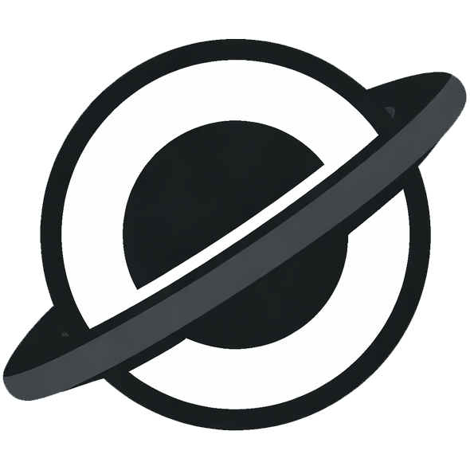

<h1>
  
  Hybrid Engine
</h1>

[](README_zh-CN.md)
[](https://isocpp.org/)
[](./LICENSE)

> A personal engine project for studying modern engine architecture, runtime/editor boundaries, and practical toolchain design through real implementation work.


## Overview

[](#requirements)
[](#features--current-status)
[](#features--current-status)
[](#features--current-status)
[](#roadmap)

Hybrid Engine is a long-term implementation playground for understanding how rendering, assets, scene data, editor tooling, input, events, and runtime systems should be structured and how they evolve together.

Current development is mainly focused on:

- editor-driven scene workflow
- asset import, metadata, and cooked-cache pipeline
- render architecture cleanup and pass evolution
- play-mode transitions, scene switching, and early physics iteration

## Status Snapshot

| Platform | Toolchain |
| --- | --- |
| Windows 10 / 11 | Visual Studio 2022 + MSVC + CMake 3.20+ |

| Rendering | Main Entry |
| --- | --- |
| OpenGL 4.5 | `bin\HybridEditor.exe` |

| Current Focus | Dev Log |
| --- | --- |
| Editor, asset pipeline, render architecture, scene workflow | `docs/CHANGELOG.md` |

## Requirements

Current primary development environment:

- Windows 10 or Windows 11
- CMake 3.20 or later
- A compiler with C++17 support
- Visual Studio 2022 / MSVC is the recommended toolchain
- A GPU and driver environment capable of running OpenGL 4.5

## Build and Run

Initialize submodules first:

```bash
git submodule update --init --recursive
```

Configure and build manually:

```bash
cmake -S . -B build
cmake --build build --config Release
```

Or use the Windows helper script:

```bat
build_windows.bat
```

Run the editor:

```bat
bin\HybridEditor.exe
```

Runtime notes:

- The build copies the editor executable, shaders, and editor resources into `bin/`.
- On first launch, the engine automatically initializes `bin/GameProject/` and creates a default `GameProject.hyproj` if it does not already exist.
- Runtime logs are written to `bin/hybrid_engine.log`.

## Documentation

Project documentation lives under `docs/`:

- [Changelog](docs/CHANGELOG.md): development history and milestone notes
- [Development Plan](docs/plans/PROJECT_PLAN_ENG.md): current plan and longer-term structure
- [Render System](docs/systems/render_system.md): current render-system architecture and pass layout
- [Resource System](docs/systems/resource_system.md): runtime/editor asset pipeline, registry, cache, and loading flow
- [Render ECS Asset Chain](docs/systems/render_ecs_asset_chain.md): integration notes for mesh, material, ECS, and editor flow inside the render path
- [Event System](docs/systems/event_system.md): event dispatch and input/event bridge notes
- [Log System](docs/systems/log_system.md): logging structure and usage

## Features & Current Status

Already implemented or broadly usable:

- Core runtime foundation: logging, events, input, window system, and main loop
- Rendering baseline: OpenGL backend, framebuffer path, forward rendering, and Scene / Game viewport split
- Scene system: EnTT-based entities and components, scene serialization, hierarchy data, and the `scene_document` flow
- Editor basics: docking UI, Hierarchy, Inspector, Scene View, Game View, Project Panel, gizmo interaction, and object picking
- Asset-system baseline: VFS logical paths, asset registry, `.meta` files, cooked cache output, and loading for textures, meshes, materials, and scenes
- Import workflow: OBJ import, material generation, texture import, drag-and-drop scene placement, and initial hot-reload support
- Lighting: directional lights and point lights in the current render path
- Physics baseline: AABB collision, collider registration, rigidbody iteration, and collider gizmo debugging

Still under active development:

- The render-pipeline split is still being refined and higher-level pass orchestration is not fully settled yet.
- Shadow, outline, and post-process paths have started but are not complete yet.
- The physics system is still in an early iteration phase and remains unstable overall.
- The editor workflow is already useful for experiments and feature validation, but polish, reliability, and tooling depth still need work.
- Audio and scripting systems have not been implemented yet.

## Roadmap

Near-term focus:

- continue refining render-pipeline structure, including pass execution flow, shader management, and data upload paths
- improve physics behavior, rigidbody flow, and editor-side debugging support
- strengthen scene-editing reliability across edit/play transitions
- keep improving asset hot reload, cache invalidation, and import stability

Planned future work:

- more complete rendering features such as shadows, outline, and post-process
- a more polished editor workflow and better panel-level usability
- broader coverage for default resources and failure paths in the asset system
- audio-system exploration
- scripting support and runtime extensibility after the core architecture becomes more stable

For the broader plan, see [docs/plans/PROJECT_PLAN_ENG.md](docs/plans/PROJECT_PLAN_ENG.md).

## Closing Notes

Hybrid Engine is still a long-term personal learning and research project. If you are also interested in engine architecture, editor tooling, or asset workflows, feel free to reach out.

Special thanks to [@SaluteBEE](https://github.com/SaluteBEE) and [@zong4](https://github.com/zong4) for support, collaboration, and discussion.
Contact:

- Portfolio: [Portfolio](https://the-lyricis.github.io/)
- Email: pigchick1623@gmail.com
